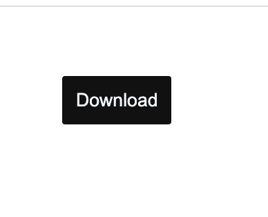

# Intercom Test

A project on finding nearest users from a list within **X** Kms of range using Haversine formula. This project is creating using react and jest.

## Installation

Use the package manager [npm](https://nodejs.org/en/download/) to install foobar.

```bash
git clone git@github.com:code-storm/intercom-test.git
cd ./intercom-test
npm install ## to install all dependencies
```

## Usage

```bash
npm start ## to compile and run intercom-test app in browser
```

## Steps
 

Run `npm start` to open app in the browser.
Click on the Download button to get [output.txt](https://github.com/code-storm/intercom-test/blob/master/output.txt).
This app take [customer.txt](https://github.com/code-storm/intercom-test/blob/master/src/customer.txt) as input and download output.txt consisting of all users near 100 Kms of Base Location (Dublin Office in this case) sorted by user_id in ASCENDING order.


## Test

```bash
npm run test ## to run unit test cases
```

## License
[MIT](https://choosealicense.com/licenses/mit/)
